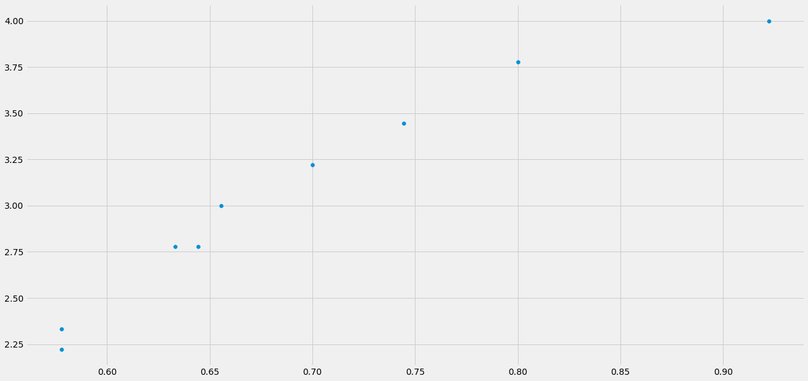

# On changes to the grading system

My child's middle school has recently decided to change the way they do grading. To their credit they have been delightfully transparent; they have provided a transcripted video to the parents as well as citations to the books and articles that have most influenced their thinking. 

Much of the changes are, I believe, good. Some are bad. The purpose of this paper is to detail my dissent such that I may be corrected where I am wrong and affect change where I am correct.

This paper begins with a marked up version of the transcript from the video the teachers sent out (henceforth _transcript_) where I highlight what I consider important and with what I dissent. I then elaborate on each point of dissent, and finish up with an example of the grading systems under consideration.

[link](#Benefits-of-the-four-point-scale)

# Transcript of _Grading Practices_ Video

Below is the _transcript_ of the video the school put together to explain the new grading system. I've removed names and lightly edited for clarity. **<mark>important statements are highlighted in yellow</mark>**. **<mark style="background-color: #f9987c">statements that I deal with in this paper are highlighted  in red</mark>**

## Intro
> The teachers have spent a year and a half meeting, collaborating, reading the book **<mark>Grading for Equity by Joe Feldman</mark>**, and discussing the most effective ways to communicate about students’ academic growth and student achievement.  These same conversations are happening in districts throughout the country because educators feel an obligation to ensure that our grading practices are as **<mark>equitable, accurate, bias-resistant, and motivating</mark>** as possible for our students. I’m incredibly proud of the middle school team and all of the work that they have put into looking very carefully at how we apply grades to student achievement and really making sure that we’re focusing on skill proficiency and taking the whole child into consideration.  Take care.  We’ll talk to you soon. 


## Purpose and philosophy of grades

> The purpose of a grade is to provide information about how well a student is understanding and applying the content and skills in a subject after they’ve had a chance to learn and practice.
>
> We want our grading practices to be <mark>**equitable, accurate, bias-resistant, and motivating**</mark> for students. Grades should accurately reflect a student’s academic level of performance, exclude nonacademic criteria such as behavior, and use mathematically sound calculations and scales. 
>
> **<mark>Our grading practices seek to counteract institutional biases and protect student grades from implicit bias</mark>** as well. Our grading practices should be motivating for students — showing them the connection between the means of learning and the ends — how doing classwork and homework is valuable not because of how many points it results in, but because that practice leads to learning.

## Practice work and performance work

> Students will engage in <mark>**two kinds of work in each course — _practice work_ and _performance work_.**</mark>
>
> <mark>**_Practice work_ — such as classwork and homework**</mark> — is essential because it helps learners improve their understanding of content and their ability to perform skills more accurately, independently, and automatically. It also provides learners with opportunities to self-assess their current understanding and skill.  
>
> <mark>**_Performance work_ — such as tests, quizzes, essays, projects, presentations**</mark> — is a time for students to demonstrate the proficiency they have achieved as a result of their practice.  The goal of performance work is for students to show how well they understand and can apply the content and skills that they’ve been practicing.  <mark>**A student’s grade for the term will be based mostly on how well they do on performance work. Teachers will typically share rubrics to show students what’s expected on performance work and will use the rubrics to provide feedback and score the work.**</mark>

## The four-point scale

> <mark>**In order to provide feedback about a student’s current level of achievement on performance work, we are using a 4 point scale.**</mark>  You might notice that this scale is similar to the scale used to provide feedback on our K-5 report cards and similar to the 4 point scales used to determine Grade Point Averages in high schools and colleges. **<mark style="background-color: #f9987c">And while we will still be using letter grades on middle school report cards, we will be using the 4 point scale to provide feedback on each individual piece of performance work.</mark>**
>    
> At the middle school level, the <marK>**4 numbers indicate the following levels of achievement:**</mark>  
    > 
> - <marK style="background-color: #f9987c">**`4` indicates _Distinguished_ or A level achievement;**</mark>
> - <marK style="background-color: #f9987c">**`3` indicates _Proficient_ or B level achievement;**</mark>
> - <marK style="background-color: #f9987c">**`2` indicates _Developing_ or C level achievement;**</mark>
> - <marK style="background-color: #f9987c">**`1` indicates _Beginning_ or D level achievement,**</mark>
> - <marK style="background-color: #f9987c">**`0` will indicate that there is not enough evidence by which to evaluate student achievement.**</mark>

<mark>**All performance work will be scored using this scale.**</mark>

### Benefits of the four-point scale

> There are several benefits to using a 4 point scale instead of the traditional 100-point scale:
> 
> For one, <mark style="background-color: #f9987c">**the traditional 100-point scales include 60 point values that equate with failure. That imbalance implies that failure is more expected than not.**</mark>.
> 
> <mark>**Another flaw of the 100-point scale is that if a zero is factored in, the average is brought so low that it’s mathematically difficult — if not impossible — to bring it back up to a passing grade.**</mark>
> 
> A 4 point scale evens out the emphasis on each letter grade and eliminates the devastating impact of a zero.  Also, <mark style="background-color: #f9987c">**a 4 point scale can help shift student’s perception away from the idea that the goal of course work is to accrue points**</mark> rather than to practice, grow, and get helpful feedback on their skills and understandings.

## Canvas

### How _practice_ and _performance_ work are shown on Canvas

> <mark>**Practice work — such as classwork and homework**</mark> — will be tracked in Canvas so that students and caregivers can see how practice supports the student’s ability to do well on performance work. But practice work <mark>onlys counts minimally — 1% — toward a student’s overall grade.</mark>  
>
> <mark>**Performance work is tracked in a separate category that counts as 99% of the total grade.**</mark>  Both categories — practice and performance — as well as the total overall grade — will be shown as both a percentage and as a letter grade or a proficiency descriptor.   <mark>**The problem is that the percentages that appear in Canvas do not align or match up with the traditional grading system.  So, we suggest that students and parents ignore any percentages they see in Canvas and instead focus on the letter grades such as A, B, C, etc.**</mark>
>
> So, in the example [not]shown here, the average as shown with a percentage — 68% — should be ignored.  The letter grade — a B minus — is an accurate representation of the student’s current achievement in the course. 

### Caregiver access

>Caregivers can sign on to be observers on their child’s Canvas courses.  Directions for how to do so can be found on the PSB Student and Family Tech Support Page seen here.  You can reach this page by going to:_link_ and scrolling to the bottom of the page. 
>
>Once a caregiver has created an account, they will be able to view the list of their child’s classes and see assignments within each class, including the due date and instructions.  Caregivers are also able to view their child's submission history, missing assignments, teacher feedback, and grades.

## Standards-based grades that reflect content proficiency
> <mark>**Grades on student work and on report cards will only reflect the level of proficiency a student has achieved**</mark> with regard to the course’s standards.  The practice of including other kinds of information in the grade creates ambiguity and invites bias. For example, <mark>**when we include a judgement of a student’s effort or behavior in a grade, we’re imposing a narrow idea of what good behavior looks like or of how a “successful” student behaves. And when we include work completion in the grade, we are assessing compliance rather than proficiency.  Including these kinds of factors in a grade also creates ambiguity so that it becomes unclear what the grade is trying to communicate.**</mark>

> For these reasons, what a teacher may perceive <mark>**regarding a student’s participation, effort, and behavior**</mark> will not be assessed with a score or reflected in the grade, but rather <mark>**teachers will communicate when necessary**</mark> about students’ classroom experiences and work completion through verbal and/or written communication with students and caregivers as needed.  And remember, caregivers can view their child’s work submission in Canvas to stay informed about work completion.

## Late work

> <mark>**There will be no reduction in scores because work is late. Deducting points because work is late combines both academic and nonacademic information in the grade**</mark> and creates what author Susan Brookhart calls “grade fog” — we’re not sure what the grade means because we’re asking it to communicate too much unrelated information. For example, if a student who writes an A-quality essay but hands it in late gets her assignment downgraded to a B, and a student who writes a B-quality essay turned in by the deadline receives a B, then there’s nothing to distinguish those two B grades, although those students have very different levels of content mastery.  Therefore, work will typically be accepted late as long as the work is still relevant to what students are learning in class — for example during the current unit, and it’s still the same grading quarter during which it was assigned.

## Practice and time management

> Even though scores will not reflect the timeliness of work submission, <mark>**teachers will still communicate deadlines and due dates for assignments and expect students to meet those timelines whenever possible.**</mark>  Teachers will communicate with students and caregivers if there is a concern about a student not completing their work in a timely manner. <mark>**Additionally, teachers will frequently emphasize the connection between practice and performance.**</mark>

## Retakes, redos, and revisions

> <mark>**Most of the time, if a student is not satisfied with their score on performance work, they will have an opportunity to try again through a retake, redo, or revision.  In fact, teachers will expect students to do a retake, redo, or revision if they do not do well on performance work.  Before a second attempt, students will need to engage in additional practice and/or receive teacher support to help them better understand the content/skills.  Teachers will factor the score from their highest level of performance with a skill — or skill set — toward the term grade.**</mark>

## How term grades will be calculated

> I teach seventh and eighth grade English Language Arts at Lawrence.  I’m going to talk about how term grades will be calculated, and review the grading practices we’ve outlined in this video.  
>
> In order to determine the letter grade that will appear on a child’s report card, <mark>**scores on performance work throughout a term will be added together and divided by the number of scores included to find an average letter grade equivalency.**</mark>  
>
> So, <mark style="background-color: #f9987c">**for example, if a student’s scores on performance work in a course during the term are `3`, `4`, `3`, `3`, `2`, and `3`, then the total of those scores - `18` - is divided by the number of scores - `6` - to arrive at the average of `3.0` which equates to a B.**</mark>
>
> Canvas is set to calculate these averages and convert them to letter grades, and that information will be available to students and caregiver observers in Canvas after the first few weeks of each term — once there are enough grades to calculate a meaningful average.  
>
> <mark style="background-color: #f9987c">**Notice that percentages and fractions are not relevant to our grading system.**</mark>  A 3 is simply a stand-in for a B or Proficient; it does not represent a 3 out of 4 possible points, which as a fraction would be a 75%. Again, Canvas has been set to interpret these scores as stand-ins for the letter grades and to calculate averages based on those equivalents rather than on fractions and percentages.  <mark>**Any fractions and percentages shown in Canvas should be ignored as only letter grades and proficiency descriptors will accurately represent a student’s achievement.**</mark>

## Summary

> So, to review,  the grading practices that we are using in the middle school grades at Lawrence include the following:
>
> - A 4 point scale will be used — with each number representing a level of proficiency.
> - Term grades will be based mostly on performance work rather than practice work.
> - Practice work will be tracked in Canvas separately from performance work.
> - Typically, late work will be accepted during the same unit and term it was assigned with no score reduction.
> - Retakes, redos, and revisions of performances work will be allowed and sometimes even expected.
> - Behaviors — such as participation, effort, and conduct — will not be reflected in the grade or assessed with a score, but rather teachers will communicate about a student’s classroom experiences and work completion through verbal and/or written communication as needed.


## References

> The grading practices we are using in the middle school at Lawrence are based on the book _Grading for Equity_ by Joe Feldman.  
>
> To read an article about these grading practices in Harvard’s Graduate School of Education magazine, search for: “[Grade Expectations: Why we need to rethink grading in our schools” by Lory Hough](https://www.gse.harvard.edu/news/ed/19/05/grade-exapectations).  To listen to a podcast, search for:  “Harvard EdCast: Grading for Equity”
>
>If you have a general question about these grading practices, please reach out to your child’s advisory teacher or [the] Principal.  If you have a course specific question, please reach out to the teacher of that course.  Our emails are _redacted_.
>
> We hope this video was informative and useful.  The entire middle school faculty and administration is looking forward to a fantastic year of learning and joy with our students.  Thanks for watching!


# Points of dissent

## The 0-100 scale _IS NOT_ oriented toward failure

In the _transcript_ this statement is made: 
>  The traditional 100-point scales include 60 point values that equate with failure. That imbalance implies that failure is more expected than not.

This appears to come _Grading for Equity_ in a section titled **The 0–100 Scale’s Orientation Toward Failure**

> The first mathematical problem is that the scale is disproportionately weighted toward failure and therefore sends the message that failure is more likely than success.... Our scale allocates sixty of its 100 numbers (0–59) to the failure scale while only forty numbers (61–100) are allocated to passing. <mark>**What does this say to our students about learning and achievement? That we value failure over success—why else would we want to describe failure in sixty different ways but proficiency (B or above) in only twenty ways?**</mark>

That this statement is written in the form of a question is telling.

No, we do not "value failure over success". The 60 points in the failing range are a side-effect of the **fine resoluton we want at the higher level (more on this later)**. We make explicit their lesser importance when we apply eleven ordinal labels  (`A`,`A-`,`B+`,`B`,`B-`,`C+`,`C`,`C-`,`D+`,`D`,`D-`) to levels of success and only one (`F`) to failure.

That is not to say the 0-100 scale is without flaws. Feldman believes that:

> its real harm occurs when the 100-point percentage scale is applied to assignments across a term: It becomes nearly impossible for a student to overcome low grades.

I agree. If a final grade is a tool to measure content mastery, an early `0` can render the tool less effective. For example, a `0` on one test followed by four `90`s yields a grade of `72`, which likely misrepresents the mastery of the student who just strung together four `A-`s.


This criticism is valid, but it damns our blindness to the temporality of grades and our usual mode of grading missing work as a `0`, the latter of which is eloquently addressed by Feldman.

> when we assign missing work a score of zero; we don’t know what a student’s performance would be on that assignment, but because we don’t have the assignment... we record it as a performance of zero knowledge. Not having evidence of what a student knows isn’t the same as having evidence that she knows nothing!

None of this damns the 0-100 scale itself. 

## A four-point scale _DOES NOT_ shift student's perception away from the idea that the goal of course work is to accrue points

In introducing the four point scale in the _transcript_ it's said that:

> In order to provide feedback about a student’s current level of achievement on performance work, we are using a 4 point scale... similar to the 4 point scales used to determine Grade Point Averages in high schools and colleges

Most of the people likely to read this have been to colleges that use such a GPA scale, some for many years. I suspect it's a lonely few if any at all that would say that the GPA scale can, as stated later in the _transcript_: 

>  can help shift student’s perception away from the idea that the goal of course work is to accrue points

I'll say no more about this.

## A four-point scale DOES harm students

The 0-4 scale does three things.


###  It drastically reduces resolution in the range most students score.

Most students pass. Feldman often cites a work by Carifio & Carey (see "Minimum Grading" chapter in Appendix) that shows "Mill City High School" students, on average pass 75.9%, fail 18.2% , and withdraw from 5.9% of their classes.

A 0-4 scale has only **two** levels for passing grades. Such coarse resolution is antithetical to communicating mastery.

|scale      | total resolution | failing resolution |  passing resolution | labels |
|-----------|------------------|--------------------|---------------------|--------|
|0-4        | 4                | 3                  | 2                   |`4`(`A`),`3`(`B`),`2`(`C`),`1`(`D`),`0`    |
|Letter     | 5                | 1                  | 4                   |`A`,`B`,`C`,`D`,`F`|
|Letter+    | 12               | 1                  | 11                  |`A`,`A-`,`B+`,`B`,`B-`,`C+`,`C`,`C-`,`D+`,`D`,`D-`,`F`|
|0-100      | 101              | 60                 | 40                  |0-100 |


### It lowers the bar

Put simply, I understand that:

- What was once a grade `A` is now a grade `A`
- What was once a grade `B` is now a grade `A`
- What was once a grade `C` is now a grade `B`
- What was once a grade `D` is now a grade `B`
- What was once a grade `F` is now a grade `C`, `D`, or `F`

In the table below, taken from Feldman's book, he indicates that:

- 20% of the scores (presumably `0` ) represent failure.
- 40% of the scores (presumably `4` and `3`) represent meeting the standard

Conspicously left out of the table are `1` (`Beginning`) and `2` (`Developing`).  Though they are without a label, the -`ing` at the end betrays that it is not a adequately complete state. I understand this to mean that it _does not_ meet the standard.

| |Number of Gradations  | Scores that represent failing    | Percentage of scores representing failing   |  Scores that represnt meeting standards (B or Above)  | Percentage of scale representing scores of meeting standard   |   
|---|---|---|---|---|---|
| 0-100 point scale | 100 | 0-59 | 60% | 80-100 | 21% |
| 0-4 point scale | 4 | 0 | 20% | 3-4 | 40% |


## Why not a minimum grading scheme?

Feldman seems to advocate most strongly for a minimum grading scheme. I find little in it objectionable and nothing nearly so much as I do in the 0-4 scale. Was this considered and decided against or not considered at all?

# Clarifying questions

## How Grades Will Be Calculated

for example, if a student’s scores on performance work in a course during the term are 3, 4, 3, 3, 2, and 3, then the total of those scores - 18 - is divided by the number of scores - 6 - to arrive at the average of 3.0 which equates to a B.

Canvas is set to calculate these averages and convert them to letter grades, and that information will be available to students and caregiver observers in Canvas after the first few weeks of each term — once there are enough grades to calculate a meaningful average.

Notice that percentages and fractions are not relevant to our grading system. A 

## Is a `1` or a `2` passing?

# Example: A comparison of grading scales

To make this more tangible I've contrived an example. In it there are several students that complete 9 pieces of equally-weighted _performance work_. The grades the example begins with are simple percentages. For example, if a quiz had 10 equally-weighted problems and a student got 7 correct, the score would be a `0.7`.

I then calculate what the final grades would look like under a "traditional", "0-4", and "minimum grading".

What you see in the end is that,compared to a traditional system, the 0-4 scale brings up _nearly every grade_ where the minimum grade scale increases grades at the bottom end. 


```python
import matplotlib.pyplot as plt
import pandas as pd
import matplotlib as mpl
mpl.style.use('fivethirtyeight')
plt.rcParams ["figure.figsize"] = (20,10)
```


```python
quiz_scores = pd.read_csv('quiz_scores.csv',index_col="name")
quiz_scores
```


<div>
<style scoped>
    .dataframe tbody tr th:only-of-type {
        vertical-align: middle;
    }

    .dataframe tbody tr th {
        vertical-align: top;
    }

    .dataframe thead th {
        text-align: right;
    }
</style>
<table border="1" class="dataframe">
  <thead>
    <tr style="text-align: right;">
      <th></th>
      <th>q1</th>
      <th>q2</th>
      <th>q3</th>
      <th>q4</th>
      <th>q5</th>
      <th>q6</th>
      <th>q7</th>
      <th>q8</th>
      <th>q9</th>
    </tr>
    <tr>
      <th>name</th>
      <th></th>
      <th></th>
      <th></th>
      <th></th>
      <th></th>
      <th></th>
      <th></th>
      <th></th>
      <th></th>
    </tr>
  </thead>
  <tbody>
    <tr>
      <th>evelyn</th>
      <td>0.9</td>
      <td>0.9</td>
      <td>0.6</td>
      <td>0.9</td>
      <td>0.6</td>
      <td>0.7</td>
      <td>0.8</td>
      <td>0.5</td>
      <td>0.8</td>
    </tr>
    <tr>
      <th>grace</th>
      <td>0.7</td>
      <td>0.6</td>
      <td>0.7</td>
      <td>0.7</td>
      <td>0.7</td>
      <td>0.6</td>
      <td>0.8</td>
      <td>0.8</td>
      <td>0.7</td>
    </tr>
    <tr>
      <th>iesha</th>
      <td>0.5</td>
      <td>0.5</td>
      <td>0.4</td>
      <td>0.0</td>
      <td>0.3</td>
      <td>0.6</td>
      <td>0.6</td>
      <td>0.7</td>
      <td>0.8</td>
    </tr>
    <tr>
      <th>jake</th>
      <td>0.6</td>
      <td>0.6</td>
      <td>0.5</td>
      <td>0.1</td>
      <td>0.4</td>
      <td>0.7</td>
      <td>0.7</td>
      <td>0.8</td>
      <td>0.9</td>
    </tr>
    <tr>
      <th>larry</th>
      <td>0.4</td>
      <td>0.2</td>
      <td>0.4</td>
      <td>0.7</td>
      <td>0.5</td>
      <td>0.3</td>
      <td>0.7</td>
      <td>0.5</td>
      <td>0.8</td>
    </tr>
    <tr>
      <th>lupe</th>
      <td>1.0</td>
      <td>0.8</td>
      <td>0.9</td>
      <td>0.9</td>
      <td>0.8</td>
      <td>0.9</td>
      <td>1.0</td>
      <td>1.0</td>
      <td>1.0</td>
    </tr>
    <tr>
      <th>michelle</th>
      <td>0.8</td>
      <td>0.8</td>
      <td>0.5</td>
      <td>0.8</td>
      <td>0.5</td>
      <td>0.6</td>
      <td>0.7</td>
      <td>0.4</td>
      <td>0.7</td>
    </tr>
    <tr>
      <th>rebecca</th>
      <td>0.8</td>
      <td>0.7</td>
      <td>0.8</td>
      <td>0.8</td>
      <td>0.8</td>
      <td>0.7</td>
      <td>0.9</td>
      <td>0.9</td>
      <td>0.8</td>
    </tr>
    <tr>
      <th>steven</th>
      <td>0.5</td>
      <td>0.3</td>
      <td>0.5</td>
      <td>0.8</td>
      <td>0.6</td>
      <td>0.4</td>
      <td>0.8</td>
      <td>0.6</td>
      <td>0.9</td>
    </tr>
  </tbody>
</table>
</div>


## Traditional scale

The traditional way to evaluate these students is to average their grades together `tAvg` and assign them a corresponding letter grade `tLabel`. 

### Calculate average


```python
def Average(df):
    return df.mean(axis=1)

quiz_scores['tAvg'] = Average(quiz_scores)
quiz_scores
```


<div>
<style scoped>
    .dataframe tbody tr th:only-of-type {
        vertical-align: middle;
    }

    .dataframe tbody tr th {
        vertical-align: top;
    }

    .dataframe thead th {
        text-align: right;
    }
</style>
<table border="1" class="dataframe">
  <thead>
    <tr style="text-align: right;">
      <th></th>
      <th>q1</th>
      <th>q2</th>
      <th>q3</th>
      <th>q4</th>
      <th>q5</th>
      <th>q6</th>
      <th>q7</th>
      <th>q8</th>
      <th>q9</th>
      <th>tAvg</th>
    </tr>
    <tr>
      <th>name</th>
      <th></th>
      <th></th>
      <th></th>
      <th></th>
      <th></th>
      <th></th>
      <th></th>
      <th></th>
      <th></th>
      <th></th>
    </tr>
  </thead>
  <tbody>
    <tr>
      <th>evelyn</th>
      <td>0.9</td>
      <td>0.9</td>
      <td>0.6</td>
      <td>0.9</td>
      <td>0.6</td>
      <td>0.7</td>
      <td>0.8</td>
      <td>0.5</td>
      <td>0.8</td>
      <td>0.744444</td>
    </tr>
    <tr>
      <th>grace</th>
      <td>0.7</td>
      <td>0.6</td>
      <td>0.7</td>
      <td>0.7</td>
      <td>0.7</td>
      <td>0.6</td>
      <td>0.8</td>
      <td>0.8</td>
      <td>0.7</td>
      <td>0.700000</td>
    </tr>
    <tr>
      <th>iesha</th>
      <td>0.5</td>
      <td>0.5</td>
      <td>0.4</td>
      <td>0.0</td>
      <td>0.3</td>
      <td>0.6</td>
      <td>0.6</td>
      <td>0.7</td>
      <td>0.8</td>
      <td>0.488889</td>
    </tr>
    <tr>
      <th>jake</th>
      <td>0.6</td>
      <td>0.6</td>
      <td>0.5</td>
      <td>0.1</td>
      <td>0.4</td>
      <td>0.7</td>
      <td>0.7</td>
      <td>0.8</td>
      <td>0.9</td>
      <td>0.588889</td>
    </tr>
    <tr>
      <th>larry</th>
      <td>0.4</td>
      <td>0.2</td>
      <td>0.4</td>
      <td>0.7</td>
      <td>0.5</td>
      <td>0.3</td>
      <td>0.7</td>
      <td>0.5</td>
      <td>0.8</td>
      <td>0.500000</td>
    </tr>
    <tr>
      <th>lupe</th>
      <td>1.0</td>
      <td>0.8</td>
      <td>0.9</td>
      <td>0.9</td>
      <td>0.8</td>
      <td>0.9</td>
      <td>1.0</td>
      <td>1.0</td>
      <td>1.0</td>
      <td>0.922222</td>
    </tr>
    <tr>
      <th>michelle</th>
      <td>0.8</td>
      <td>0.8</td>
      <td>0.5</td>
      <td>0.8</td>
      <td>0.5</td>
      <td>0.6</td>
      <td>0.7</td>
      <td>0.4</td>
      <td>0.7</td>
      <td>0.644444</td>
    </tr>
    <tr>
      <th>rebecca</th>
      <td>0.8</td>
      <td>0.7</td>
      <td>0.8</td>
      <td>0.8</td>
      <td>0.8</td>
      <td>0.7</td>
      <td>0.9</td>
      <td>0.9</td>
      <td>0.8</td>
      <td>0.800000</td>
    </tr>
    <tr>
      <th>steven</th>
      <td>0.5</td>
      <td>0.3</td>
      <td>0.5</td>
      <td>0.8</td>
      <td>0.6</td>
      <td>0.4</td>
      <td>0.8</td>
      <td>0.6</td>
      <td>0.9</td>
      <td>0.600000</td>
    </tr>
  </tbody>
</table>
</div>


###  Apply letter grades

We'll also add a column for the letter grades


```python
def letter_grade(decimal_grade):
    if   decimal_grade >= 0.93: return "A"
    elif decimal_grade >= 0.90: return "A-"
    elif decimal_grade >= 0.87: return "B+"
    elif decimal_grade >= 0.83: return "B"
    elif decimal_grade >= 0.80: return "B-"
    elif decimal_grade >= 0.77: return "C+"
    elif decimal_grade >= 0.73: return "C"
    elif decimal_grade >= 0.70: return "C-"
    elif decimal_grade >= 0.67: return "D+"
    elif decimal_grade >= 0.63: return "D"
    elif decimal_grade >= 0.60: return "D-"
    else:                       return "F"

quiz_scores['tLabel'] = quiz_scores['tAvg'].apply(lambda x: letter_grade(x))
quiz_scores
```


<div>
<style scoped>
    .dataframe tbody tr th:only-of-type {
        vertical-align: middle;
    }

    .dataframe tbody tr th {
        vertical-align: top;
    }

    .dataframe thead th {
        text-align: right;
    }
</style>
<table border="1" class="dataframe">
  <thead>
    <tr style="text-align: right;">
      <th></th>
      <th>q1</th>
      <th>q2</th>
      <th>q3</th>
      <th>q4</th>
      <th>q5</th>
      <th>q6</th>
      <th>q7</th>
      <th>q8</th>
      <th>q9</th>
      <th>tAvg</th>
      <th>tLabel</th>
    </tr>
    <tr>
      <th>name</th>
      <th></th>
      <th></th>
      <th></th>
      <th></th>
      <th></th>
      <th></th>
      <th></th>
      <th></th>
      <th></th>
      <th></th>
      <th></th>
    </tr>
  </thead>
  <tbody>
    <tr>
      <th>evelyn</th>
      <td>0.9</td>
      <td>0.9</td>
      <td>0.6</td>
      <td>0.9</td>
      <td>0.6</td>
      <td>0.7</td>
      <td>0.8</td>
      <td>0.5</td>
      <td>0.8</td>
      <td>0.744444</td>
      <td>C</td>
    </tr>
    <tr>
      <th>grace</th>
      <td>0.7</td>
      <td>0.6</td>
      <td>0.7</td>
      <td>0.7</td>
      <td>0.7</td>
      <td>0.6</td>
      <td>0.8</td>
      <td>0.8</td>
      <td>0.7</td>
      <td>0.700000</td>
      <td>C-</td>
    </tr>
    <tr>
      <th>iesha</th>
      <td>0.5</td>
      <td>0.5</td>
      <td>0.4</td>
      <td>0.0</td>
      <td>0.3</td>
      <td>0.6</td>
      <td>0.6</td>
      <td>0.7</td>
      <td>0.8</td>
      <td>0.488889</td>
      <td>F</td>
    </tr>
    <tr>
      <th>jake</th>
      <td>0.6</td>
      <td>0.6</td>
      <td>0.5</td>
      <td>0.1</td>
      <td>0.4</td>
      <td>0.7</td>
      <td>0.7</td>
      <td>0.8</td>
      <td>0.9</td>
      <td>0.588889</td>
      <td>F</td>
    </tr>
    <tr>
      <th>larry</th>
      <td>0.4</td>
      <td>0.2</td>
      <td>0.4</td>
      <td>0.7</td>
      <td>0.5</td>
      <td>0.3</td>
      <td>0.7</td>
      <td>0.5</td>
      <td>0.8</td>
      <td>0.500000</td>
      <td>F</td>
    </tr>
    <tr>
      <th>lupe</th>
      <td>1.0</td>
      <td>0.8</td>
      <td>0.9</td>
      <td>0.9</td>
      <td>0.8</td>
      <td>0.9</td>
      <td>1.0</td>
      <td>1.0</td>
      <td>1.0</td>
      <td>0.922222</td>
      <td>A-</td>
    </tr>
    <tr>
      <th>michelle</th>
      <td>0.8</td>
      <td>0.8</td>
      <td>0.5</td>
      <td>0.8</td>
      <td>0.5</td>
      <td>0.6</td>
      <td>0.7</td>
      <td>0.4</td>
      <td>0.7</td>
      <td>0.644444</td>
      <td>D</td>
    </tr>
    <tr>
      <th>rebecca</th>
      <td>0.8</td>
      <td>0.7</td>
      <td>0.8</td>
      <td>0.8</td>
      <td>0.8</td>
      <td>0.7</td>
      <td>0.9</td>
      <td>0.9</td>
      <td>0.8</td>
      <td>0.800000</td>
      <td>B-</td>
    </tr>
    <tr>
      <th>steven</th>
      <td>0.5</td>
      <td>0.3</td>
      <td>0.5</td>
      <td>0.8</td>
      <td>0.6</td>
      <td>0.4</td>
      <td>0.8</td>
      <td>0.6</td>
      <td>0.9</td>
      <td>0.600000</td>
      <td>D-</td>
    </tr>
  </tbody>
</table>
</div>


## 0-4 scale

First we replace scores

### Replace scores with 0-4


```python
quiz_cols = [col for col in quiz_scores if col.startswith('q')]
quiz_scores_zf = quiz_scores.copy()[quiz_cols]

for quiz_col in quiz_cols:
    quiz_scores_zf[quiz_col][quiz_scores_zf[quiz_col]>=0.8] = 4
    quiz_scores_zf[quiz_col][quiz_scores_zf[quiz_col]<0.2]  = 0
    quiz_scores_zf[quiz_col][quiz_scores_zf[quiz_col]<0.4]  = 1
    quiz_scores_zf[quiz_col][quiz_scores_zf[quiz_col]<0.6]  = 2
    quiz_scores_zf[quiz_col][quiz_scores_zf[quiz_col]<0.8]  = 3

quiz_scores_zf
```


<div>
<style scoped>
    .dataframe tbody tr th:only-of-type {
        vertical-align: middle;
    }

    .dataframe tbody tr th {
        vertical-align: top;
    }

    .dataframe thead th {
        text-align: right;
    }
</style>
<table border="1" class="dataframe">
  <thead>
    <tr style="text-align: right;">
      <th></th>
      <th>q1</th>
      <th>q2</th>
      <th>q3</th>
      <th>q4</th>
      <th>q5</th>
      <th>q6</th>
      <th>q7</th>
      <th>q8</th>
      <th>q9</th>
    </tr>
    <tr>
      <th>name</th>
      <th></th>
      <th></th>
      <th></th>
      <th></th>
      <th></th>
      <th></th>
      <th></th>
      <th></th>
      <th></th>
    </tr>
  </thead>
  <tbody>
    <tr>
      <th>evelyn</th>
      <td>4.0</td>
      <td>4.0</td>
      <td>3.0</td>
      <td>4.0</td>
      <td>3.0</td>
      <td>3.0</td>
      <td>4.0</td>
      <td>2.0</td>
      <td>4.0</td>
    </tr>
    <tr>
      <th>grace</th>
      <td>3.0</td>
      <td>3.0</td>
      <td>3.0</td>
      <td>3.0</td>
      <td>3.0</td>
      <td>3.0</td>
      <td>4.0</td>
      <td>4.0</td>
      <td>3.0</td>
    </tr>
    <tr>
      <th>iesha</th>
      <td>2.0</td>
      <td>2.0</td>
      <td>2.0</td>
      <td>1.0</td>
      <td>1.0</td>
      <td>3.0</td>
      <td>3.0</td>
      <td>3.0</td>
      <td>4.0</td>
    </tr>
    <tr>
      <th>jake</th>
      <td>3.0</td>
      <td>3.0</td>
      <td>2.0</td>
      <td>1.0</td>
      <td>2.0</td>
      <td>3.0</td>
      <td>3.0</td>
      <td>4.0</td>
      <td>4.0</td>
    </tr>
    <tr>
      <th>larry</th>
      <td>2.0</td>
      <td>1.0</td>
      <td>2.0</td>
      <td>3.0</td>
      <td>2.0</td>
      <td>1.0</td>
      <td>3.0</td>
      <td>2.0</td>
      <td>4.0</td>
    </tr>
    <tr>
      <th>lupe</th>
      <td>4.0</td>
      <td>4.0</td>
      <td>4.0</td>
      <td>4.0</td>
      <td>4.0</td>
      <td>4.0</td>
      <td>4.0</td>
      <td>4.0</td>
      <td>4.0</td>
    </tr>
    <tr>
      <th>michelle</th>
      <td>4.0</td>
      <td>4.0</td>
      <td>2.0</td>
      <td>4.0</td>
      <td>2.0</td>
      <td>3.0</td>
      <td>3.0</td>
      <td>2.0</td>
      <td>3.0</td>
    </tr>
    <tr>
      <th>rebecca</th>
      <td>4.0</td>
      <td>3.0</td>
      <td>4.0</td>
      <td>4.0</td>
      <td>4.0</td>
      <td>3.0</td>
      <td>4.0</td>
      <td>4.0</td>
      <td>4.0</td>
    </tr>
    <tr>
      <th>steven</th>
      <td>2.0</td>
      <td>1.0</td>
      <td>2.0</td>
      <td>4.0</td>
      <td>3.0</td>
      <td>2.0</td>
      <td>4.0</td>
      <td>3.0</td>
      <td>4.0</td>
    </tr>
  </tbody>
</table>
</div>


### Calculate average


```python
quiz_scores_zf['Avg'] = quiz_scores_zf.mean(axis=1)
quiz_scores_zf
```


<div>
<style scoped>
    .dataframe tbody tr th:only-of-type {
        vertical-align: middle;
    }

    .dataframe tbody tr th {
        vertical-align: top;
    }

    .dataframe thead th {
        text-align: right;
    }
</style>
<table border="1" class="dataframe">
  <thead>
    <tr style="text-align: right;">
      <th></th>
      <th>q1</th>
      <th>q2</th>
      <th>q3</th>
      <th>q4</th>
      <th>q5</th>
      <th>q6</th>
      <th>q7</th>
      <th>q8</th>
      <th>q9</th>
      <th>Avg</th>
    </tr>
    <tr>
      <th>name</th>
      <th></th>
      <th></th>
      <th></th>
      <th></th>
      <th></th>
      <th></th>
      <th></th>
      <th></th>
      <th></th>
      <th></th>
    </tr>
  </thead>
  <tbody>
    <tr>
      <th>evelyn</th>
      <td>4.0</td>
      <td>4.0</td>
      <td>3.0</td>
      <td>4.0</td>
      <td>3.0</td>
      <td>3.0</td>
      <td>4.0</td>
      <td>2.0</td>
      <td>4.0</td>
      <td>3.444444</td>
    </tr>
    <tr>
      <th>grace</th>
      <td>3.0</td>
      <td>3.0</td>
      <td>3.0</td>
      <td>3.0</td>
      <td>3.0</td>
      <td>3.0</td>
      <td>4.0</td>
      <td>4.0</td>
      <td>3.0</td>
      <td>3.222222</td>
    </tr>
    <tr>
      <th>iesha</th>
      <td>2.0</td>
      <td>2.0</td>
      <td>2.0</td>
      <td>1.0</td>
      <td>1.0</td>
      <td>3.0</td>
      <td>3.0</td>
      <td>3.0</td>
      <td>4.0</td>
      <td>2.333333</td>
    </tr>
    <tr>
      <th>jake</th>
      <td>3.0</td>
      <td>3.0</td>
      <td>2.0</td>
      <td>1.0</td>
      <td>2.0</td>
      <td>3.0</td>
      <td>3.0</td>
      <td>4.0</td>
      <td>4.0</td>
      <td>2.777778</td>
    </tr>
    <tr>
      <th>larry</th>
      <td>2.0</td>
      <td>1.0</td>
      <td>2.0</td>
      <td>3.0</td>
      <td>2.0</td>
      <td>1.0</td>
      <td>3.0</td>
      <td>2.0</td>
      <td>4.0</td>
      <td>2.222222</td>
    </tr>
    <tr>
      <th>lupe</th>
      <td>4.0</td>
      <td>4.0</td>
      <td>4.0</td>
      <td>4.0</td>
      <td>4.0</td>
      <td>4.0</td>
      <td>4.0</td>
      <td>4.0</td>
      <td>4.0</td>
      <td>4.000000</td>
    </tr>
    <tr>
      <th>michelle</th>
      <td>4.0</td>
      <td>4.0</td>
      <td>2.0</td>
      <td>4.0</td>
      <td>2.0</td>
      <td>3.0</td>
      <td>3.0</td>
      <td>2.0</td>
      <td>3.0</td>
      <td>3.000000</td>
    </tr>
    <tr>
      <th>rebecca</th>
      <td>4.0</td>
      <td>3.0</td>
      <td>4.0</td>
      <td>4.0</td>
      <td>4.0</td>
      <td>3.0</td>
      <td>4.0</td>
      <td>4.0</td>
      <td>4.0</td>
      <td>3.777778</td>
    </tr>
    <tr>
      <th>steven</th>
      <td>2.0</td>
      <td>1.0</td>
      <td>2.0</td>
      <td>4.0</td>
      <td>3.0</td>
      <td>2.0</td>
      <td>4.0</td>
      <td>3.0</td>
      <td>4.0</td>
      <td>2.777778</td>
    </tr>
  </tbody>
</table>
</div>


### Apply letter grades


```python
def zf_label(decimal):
    if int(decimal) == 0: return 'Not Yet'
    if int(decimal) == 1: return "D" #Beginning
    if int(decimal) == 2: return "C" #Developing
    if int(decimal) == 3: return "B" #Proficient
    if int(decimal) == 4: return "A" #Distinguished

quiz_scores_zf['Label'] = quiz_scores_zf['Avg'].apply(lambda x: zf_label(x))
quiz_scores_zf
```


<div>
<style scoped>
    .dataframe tbody tr th:only-of-type {
        vertical-align: middle;
    }

    .dataframe tbody tr th {
        vertical-align: top;
    }

    .dataframe thead th {
        text-align: right;
    }
</style>
<table border="1" class="dataframe">
  <thead>
    <tr style="text-align: right;">
      <th></th>
      <th>q1</th>
      <th>q2</th>
      <th>q3</th>
      <th>q4</th>
      <th>q5</th>
      <th>q6</th>
      <th>q7</th>
      <th>q8</th>
      <th>q9</th>
      <th>Avg</th>
      <th>Label</th>
    </tr>
    <tr>
      <th>name</th>
      <th></th>
      <th></th>
      <th></th>
      <th></th>
      <th></th>
      <th></th>
      <th></th>
      <th></th>
      <th></th>
      <th></th>
      <th></th>
    </tr>
  </thead>
  <tbody>
    <tr>
      <th>evelyn</th>
      <td>4.0</td>
      <td>4.0</td>
      <td>3.0</td>
      <td>4.0</td>
      <td>3.0</td>
      <td>3.0</td>
      <td>4.0</td>
      <td>2.0</td>
      <td>4.0</td>
      <td>3.444444</td>
      <td>B</td>
    </tr>
    <tr>
      <th>grace</th>
      <td>3.0</td>
      <td>3.0</td>
      <td>3.0</td>
      <td>3.0</td>
      <td>3.0</td>
      <td>3.0</td>
      <td>4.0</td>
      <td>4.0</td>
      <td>3.0</td>
      <td>3.222222</td>
      <td>B</td>
    </tr>
    <tr>
      <th>iesha</th>
      <td>2.0</td>
      <td>2.0</td>
      <td>2.0</td>
      <td>1.0</td>
      <td>1.0</td>
      <td>3.0</td>
      <td>3.0</td>
      <td>3.0</td>
      <td>4.0</td>
      <td>2.333333</td>
      <td>C</td>
    </tr>
    <tr>
      <th>jake</th>
      <td>3.0</td>
      <td>3.0</td>
      <td>2.0</td>
      <td>1.0</td>
      <td>2.0</td>
      <td>3.0</td>
      <td>3.0</td>
      <td>4.0</td>
      <td>4.0</td>
      <td>2.777778</td>
      <td>C</td>
    </tr>
    <tr>
      <th>larry</th>
      <td>2.0</td>
      <td>1.0</td>
      <td>2.0</td>
      <td>3.0</td>
      <td>2.0</td>
      <td>1.0</td>
      <td>3.0</td>
      <td>2.0</td>
      <td>4.0</td>
      <td>2.222222</td>
      <td>C</td>
    </tr>
    <tr>
      <th>lupe</th>
      <td>4.0</td>
      <td>4.0</td>
      <td>4.0</td>
      <td>4.0</td>
      <td>4.0</td>
      <td>4.0</td>
      <td>4.0</td>
      <td>4.0</td>
      <td>4.0</td>
      <td>4.000000</td>
      <td>A</td>
    </tr>
    <tr>
      <th>michelle</th>
      <td>4.0</td>
      <td>4.0</td>
      <td>2.0</td>
      <td>4.0</td>
      <td>2.0</td>
      <td>3.0</td>
      <td>3.0</td>
      <td>2.0</td>
      <td>3.0</td>
      <td>3.000000</td>
      <td>B</td>
    </tr>
    <tr>
      <th>rebecca</th>
      <td>4.0</td>
      <td>3.0</td>
      <td>4.0</td>
      <td>4.0</td>
      <td>4.0</td>
      <td>3.0</td>
      <td>4.0</td>
      <td>4.0</td>
      <td>4.0</td>
      <td>3.777778</td>
      <td>B</td>
    </tr>
    <tr>
      <th>steven</th>
      <td>2.0</td>
      <td>1.0</td>
      <td>2.0</td>
      <td>4.0</td>
      <td>3.0</td>
      <td>2.0</td>
      <td>4.0</td>
      <td>3.0</td>
      <td>4.0</td>
      <td>2.777778</td>
      <td>C</td>
    </tr>
  </tbody>
</table>
</div>


### Compare with traditional


```python
quiz_scores['zfAvg'] = quiz_scores_zf[['Avg']]
quiz_scores['zfLabel'] = quiz_scores_zf[['Label']]
quiz_scores
```


<div>
<style scoped>
    .dataframe tbody tr th:only-of-type {
        vertical-align: middle;
    }

    .dataframe tbody tr th {
        vertical-align: top;
    }

    .dataframe thead th {
        text-align: right;
    }
</style>
<table border="1" class="dataframe">
  <thead>
    <tr style="text-align: right;">
      <th></th>
      <th>q1</th>
      <th>q2</th>
      <th>q3</th>
      <th>q4</th>
      <th>q5</th>
      <th>q6</th>
      <th>q7</th>
      <th>q8</th>
      <th>q9</th>
      <th>tAvg</th>
      <th>tLabel</th>
      <th>zfAvg</th>
      <th>zfLabel</th>
    </tr>
    <tr>
      <th>name</th>
      <th></th>
      <th></th>
      <th></th>
      <th></th>
      <th></th>
      <th></th>
      <th></th>
      <th></th>
      <th></th>
      <th></th>
      <th></th>
      <th></th>
      <th></th>
    </tr>
  </thead>
  <tbody>
    <tr>
      <th>evelyn</th>
      <td>0.9</td>
      <td>0.9</td>
      <td>0.6</td>
      <td>0.9</td>
      <td>0.6</td>
      <td>0.7</td>
      <td>0.8</td>
      <td>0.5</td>
      <td>0.8</td>
      <td>0.744444</td>
      <td>C</td>
      <td>3.444444</td>
      <td>B</td>
    </tr>
    <tr>
      <th>grace</th>
      <td>0.7</td>
      <td>0.6</td>
      <td>0.7</td>
      <td>0.7</td>
      <td>0.7</td>
      <td>0.6</td>
      <td>0.8</td>
      <td>0.8</td>
      <td>0.7</td>
      <td>0.700000</td>
      <td>C-</td>
      <td>3.222222</td>
      <td>B</td>
    </tr>
    <tr>
      <th>iesha</th>
      <td>0.5</td>
      <td>0.5</td>
      <td>0.4</td>
      <td>0.0</td>
      <td>0.3</td>
      <td>0.6</td>
      <td>0.6</td>
      <td>0.7</td>
      <td>0.8</td>
      <td>0.488889</td>
      <td>F</td>
      <td>2.333333</td>
      <td>C</td>
    </tr>
    <tr>
      <th>jake</th>
      <td>0.6</td>
      <td>0.6</td>
      <td>0.5</td>
      <td>0.1</td>
      <td>0.4</td>
      <td>0.7</td>
      <td>0.7</td>
      <td>0.8</td>
      <td>0.9</td>
      <td>0.588889</td>
      <td>F</td>
      <td>2.777778</td>
      <td>C</td>
    </tr>
    <tr>
      <th>larry</th>
      <td>0.4</td>
      <td>0.2</td>
      <td>0.4</td>
      <td>0.7</td>
      <td>0.5</td>
      <td>0.3</td>
      <td>0.7</td>
      <td>0.5</td>
      <td>0.8</td>
      <td>0.500000</td>
      <td>F</td>
      <td>2.222222</td>
      <td>C</td>
    </tr>
    <tr>
      <th>lupe</th>
      <td>1.0</td>
      <td>0.8</td>
      <td>0.9</td>
      <td>0.9</td>
      <td>0.8</td>
      <td>0.9</td>
      <td>1.0</td>
      <td>1.0</td>
      <td>1.0</td>
      <td>0.922222</td>
      <td>A-</td>
      <td>4.000000</td>
      <td>A</td>
    </tr>
    <tr>
      <th>michelle</th>
      <td>0.8</td>
      <td>0.8</td>
      <td>0.5</td>
      <td>0.8</td>
      <td>0.5</td>
      <td>0.6</td>
      <td>0.7</td>
      <td>0.4</td>
      <td>0.7</td>
      <td>0.644444</td>
      <td>D</td>
      <td>3.000000</td>
      <td>B</td>
    </tr>
    <tr>
      <th>rebecca</th>
      <td>0.8</td>
      <td>0.7</td>
      <td>0.8</td>
      <td>0.8</td>
      <td>0.8</td>
      <td>0.7</td>
      <td>0.9</td>
      <td>0.9</td>
      <td>0.8</td>
      <td>0.800000</td>
      <td>B-</td>
      <td>3.777778</td>
      <td>B</td>
    </tr>
    <tr>
      <th>steven</th>
      <td>0.5</td>
      <td>0.3</td>
      <td>0.5</td>
      <td>0.8</td>
      <td>0.6</td>
      <td>0.4</td>
      <td>0.8</td>
      <td>0.6</td>
      <td>0.9</td>
      <td>0.600000</td>
      <td>D-</td>
      <td>2.777778</td>
      <td>C</td>
    </tr>
  </tbody>
</table>
</div>


## Minimum grading

Minimum grading is a practice where it becomes impossible to get below a certain grade. The most common minimum I've seen applied in is 50%, so I'll use that here. 

Advocates say

Critics say

###  Changing individual grades


```python
quiz_scores_m = quiz_scores.copy()[quiz_cols]
quiz_scores_m

for quiz_col in quiz_cols:
    quiz_scores_m[quiz_col][quiz_scores_m[quiz_col]<0.5] = 0.5
quiz_scores_m
```


<div>
<style scoped>
    .dataframe tbody tr th:only-of-type {
        vertical-align: middle;
    }

    .dataframe tbody tr th {
        vertical-align: top;
    }

    .dataframe thead th {
        text-align: right;
    }
</style>
<table border="1" class="dataframe">
  <thead>
    <tr style="text-align: right;">
      <th></th>
      <th>q1</th>
      <th>q2</th>
      <th>q3</th>
      <th>q4</th>
      <th>q5</th>
      <th>q6</th>
      <th>q7</th>
      <th>q8</th>
      <th>q9</th>
    </tr>
    <tr>
      <th>name</th>
      <th></th>
      <th></th>
      <th></th>
      <th></th>
      <th></th>
      <th></th>
      <th></th>
      <th></th>
      <th></th>
    </tr>
  </thead>
  <tbody>
    <tr>
      <th>evelyn</th>
      <td>0.9</td>
      <td>0.9</td>
      <td>0.6</td>
      <td>0.9</td>
      <td>0.6</td>
      <td>0.7</td>
      <td>0.8</td>
      <td>0.5</td>
      <td>0.8</td>
    </tr>
    <tr>
      <th>grace</th>
      <td>0.7</td>
      <td>0.6</td>
      <td>0.7</td>
      <td>0.7</td>
      <td>0.7</td>
      <td>0.6</td>
      <td>0.8</td>
      <td>0.8</td>
      <td>0.7</td>
    </tr>
    <tr>
      <th>iesha</th>
      <td>0.5</td>
      <td>0.5</td>
      <td>0.5</td>
      <td>0.5</td>
      <td>0.5</td>
      <td>0.6</td>
      <td>0.6</td>
      <td>0.7</td>
      <td>0.8</td>
    </tr>
    <tr>
      <th>jake</th>
      <td>0.6</td>
      <td>0.6</td>
      <td>0.5</td>
      <td>0.5</td>
      <td>0.5</td>
      <td>0.7</td>
      <td>0.7</td>
      <td>0.8</td>
      <td>0.9</td>
    </tr>
    <tr>
      <th>larry</th>
      <td>0.5</td>
      <td>0.5</td>
      <td>0.5</td>
      <td>0.7</td>
      <td>0.5</td>
      <td>0.5</td>
      <td>0.7</td>
      <td>0.5</td>
      <td>0.8</td>
    </tr>
    <tr>
      <th>lupe</th>
      <td>1.0</td>
      <td>0.8</td>
      <td>0.9</td>
      <td>0.9</td>
      <td>0.8</td>
      <td>0.9</td>
      <td>1.0</td>
      <td>1.0</td>
      <td>1.0</td>
    </tr>
    <tr>
      <th>michelle</th>
      <td>0.8</td>
      <td>0.8</td>
      <td>0.5</td>
      <td>0.8</td>
      <td>0.5</td>
      <td>0.6</td>
      <td>0.7</td>
      <td>0.5</td>
      <td>0.7</td>
    </tr>
    <tr>
      <th>rebecca</th>
      <td>0.8</td>
      <td>0.7</td>
      <td>0.8</td>
      <td>0.8</td>
      <td>0.8</td>
      <td>0.7</td>
      <td>0.9</td>
      <td>0.9</td>
      <td>0.8</td>
    </tr>
    <tr>
      <th>steven</th>
      <td>0.5</td>
      <td>0.5</td>
      <td>0.5</td>
      <td>0.8</td>
      <td>0.6</td>
      <td>0.5</td>
      <td>0.8</td>
      <td>0.6</td>
      <td>0.9</td>
    </tr>
  </tbody>
</table>
</div>


```python
quiz_scores_m['Avg'] = Average(quiz_scores_m)
quiz_scores_m['Label'] = quiz_scores_m['Avg'].apply(lambda x: letter_grade(x))
quiz_scores_m
```


<div>
<style scoped>
    .dataframe tbody tr th:only-of-type {
        vertical-align: middle;
    }

    .dataframe tbody tr th {
        vertical-align: top;
    }

    .dataframe thead th {
        text-align: right;
    }
</style>
<table border="1" class="dataframe">
  <thead>
    <tr style="text-align: right;">
      <th></th>
      <th>q1</th>
      <th>q2</th>
      <th>q3</th>
      <th>q4</th>
      <th>q5</th>
      <th>q6</th>
      <th>q7</th>
      <th>q8</th>
      <th>q9</th>
      <th>Avg</th>
      <th>Label</th>
    </tr>
    <tr>
      <th>name</th>
      <th></th>
      <th></th>
      <th></th>
      <th></th>
      <th></th>
      <th></th>
      <th></th>
      <th></th>
      <th></th>
      <th></th>
      <th></th>
    </tr>
  </thead>
  <tbody>
    <tr>
      <th>evelyn</th>
      <td>0.9</td>
      <td>0.9</td>
      <td>0.6</td>
      <td>0.9</td>
      <td>0.6</td>
      <td>0.7</td>
      <td>0.8</td>
      <td>0.5</td>
      <td>0.8</td>
      <td>0.744444</td>
      <td>C</td>
    </tr>
    <tr>
      <th>grace</th>
      <td>0.7</td>
      <td>0.6</td>
      <td>0.7</td>
      <td>0.7</td>
      <td>0.7</td>
      <td>0.6</td>
      <td>0.8</td>
      <td>0.8</td>
      <td>0.7</td>
      <td>0.700000</td>
      <td>C-</td>
    </tr>
    <tr>
      <th>iesha</th>
      <td>0.5</td>
      <td>0.5</td>
      <td>0.5</td>
      <td>0.5</td>
      <td>0.5</td>
      <td>0.6</td>
      <td>0.6</td>
      <td>0.7</td>
      <td>0.8</td>
      <td>0.577778</td>
      <td>F</td>
    </tr>
    <tr>
      <th>jake</th>
      <td>0.6</td>
      <td>0.6</td>
      <td>0.5</td>
      <td>0.5</td>
      <td>0.5</td>
      <td>0.7</td>
      <td>0.7</td>
      <td>0.8</td>
      <td>0.9</td>
      <td>0.644444</td>
      <td>D</td>
    </tr>
    <tr>
      <th>larry</th>
      <td>0.5</td>
      <td>0.5</td>
      <td>0.5</td>
      <td>0.7</td>
      <td>0.5</td>
      <td>0.5</td>
      <td>0.7</td>
      <td>0.5</td>
      <td>0.8</td>
      <td>0.577778</td>
      <td>F</td>
    </tr>
    <tr>
      <th>lupe</th>
      <td>1.0</td>
      <td>0.8</td>
      <td>0.9</td>
      <td>0.9</td>
      <td>0.8</td>
      <td>0.9</td>
      <td>1.0</td>
      <td>1.0</td>
      <td>1.0</td>
      <td>0.922222</td>
      <td>A-</td>
    </tr>
    <tr>
      <th>michelle</th>
      <td>0.8</td>
      <td>0.8</td>
      <td>0.5</td>
      <td>0.8</td>
      <td>0.5</td>
      <td>0.6</td>
      <td>0.7</td>
      <td>0.5</td>
      <td>0.7</td>
      <td>0.655556</td>
      <td>D</td>
    </tr>
    <tr>
      <th>rebecca</th>
      <td>0.8</td>
      <td>0.7</td>
      <td>0.8</td>
      <td>0.8</td>
      <td>0.8</td>
      <td>0.7</td>
      <td>0.9</td>
      <td>0.9</td>
      <td>0.8</td>
      <td>0.800000</td>
      <td>B-</td>
    </tr>
    <tr>
      <th>steven</th>
      <td>0.5</td>
      <td>0.5</td>
      <td>0.5</td>
      <td>0.8</td>
      <td>0.6</td>
      <td>0.5</td>
      <td>0.8</td>
      <td>0.6</td>
      <td>0.9</td>
      <td>0.633333</td>
      <td>D</td>
    </tr>
  </tbody>
</table>
</div>


### Compare with traditional and 0-4 


```python
quiz_scores['mAvg'] = quiz_scores_m['Avg']
quiz_scores['mLabel'] = quiz_scores_m['Label']
quiz_scores
```


<div>
<style scoped>
    .dataframe tbody tr th:only-of-type {
        vertical-align: middle;
    }

    .dataframe tbody tr th {
        vertical-align: top;
    }

    .dataframe thead th {
        text-align: right;
    }
</style>
<table border="1" class="dataframe">
  <thead>
    <tr style="text-align: right;">
      <th></th>
      <th>q1</th>
      <th>q2</th>
      <th>q3</th>
      <th>q4</th>
      <th>q5</th>
      <th>q6</th>
      <th>q7</th>
      <th>q8</th>
      <th>q9</th>
      <th>tAvg</th>
      <th>tLabel</th>
      <th>zfAvg</th>
      <th>zfLabel</th>
      <th>mAvg</th>
      <th>mLabel</th>
    </tr>
    <tr>
      <th>name</th>
      <th></th>
      <th></th>
      <th></th>
      <th></th>
      <th></th>
      <th></th>
      <th></th>
      <th></th>
      <th></th>
      <th></th>
      <th></th>
      <th></th>
      <th></th>
      <th></th>
      <th></th>
    </tr>
  </thead>
  <tbody>
    <tr>
      <th>evelyn</th>
      <td>0.9</td>
      <td>0.9</td>
      <td>0.6</td>
      <td>0.9</td>
      <td>0.6</td>
      <td>0.7</td>
      <td>0.8</td>
      <td>0.5</td>
      <td>0.8</td>
      <td>0.744444</td>
      <td>C</td>
      <td>3.444444</td>
      <td>B</td>
      <td>0.744444</td>
      <td>C</td>
    </tr>
    <tr>
      <th>grace</th>
      <td>0.7</td>
      <td>0.6</td>
      <td>0.7</td>
      <td>0.7</td>
      <td>0.7</td>
      <td>0.6</td>
      <td>0.8</td>
      <td>0.8</td>
      <td>0.7</td>
      <td>0.700000</td>
      <td>C-</td>
      <td>3.222222</td>
      <td>B</td>
      <td>0.700000</td>
      <td>C-</td>
    </tr>
    <tr>
      <th>iesha</th>
      <td>0.5</td>
      <td>0.5</td>
      <td>0.4</td>
      <td>0.0</td>
      <td>0.3</td>
      <td>0.6</td>
      <td>0.6</td>
      <td>0.7</td>
      <td>0.8</td>
      <td>0.488889</td>
      <td>F</td>
      <td>2.333333</td>
      <td>C</td>
      <td>0.577778</td>
      <td>F</td>
    </tr>
    <tr>
      <th>jake</th>
      <td>0.6</td>
      <td>0.6</td>
      <td>0.5</td>
      <td>0.1</td>
      <td>0.4</td>
      <td>0.7</td>
      <td>0.7</td>
      <td>0.8</td>
      <td>0.9</td>
      <td>0.588889</td>
      <td>F</td>
      <td>2.777778</td>
      <td>C</td>
      <td>0.644444</td>
      <td>D</td>
    </tr>
    <tr>
      <th>larry</th>
      <td>0.4</td>
      <td>0.2</td>
      <td>0.4</td>
      <td>0.7</td>
      <td>0.5</td>
      <td>0.3</td>
      <td>0.7</td>
      <td>0.5</td>
      <td>0.8</td>
      <td>0.500000</td>
      <td>F</td>
      <td>2.222222</td>
      <td>C</td>
      <td>0.577778</td>
      <td>F</td>
    </tr>
    <tr>
      <th>lupe</th>
      <td>1.0</td>
      <td>0.8</td>
      <td>0.9</td>
      <td>0.9</td>
      <td>0.8</td>
      <td>0.9</td>
      <td>1.0</td>
      <td>1.0</td>
      <td>1.0</td>
      <td>0.922222</td>
      <td>A-</td>
      <td>4.000000</td>
      <td>A</td>
      <td>0.922222</td>
      <td>A-</td>
    </tr>
    <tr>
      <th>michelle</th>
      <td>0.8</td>
      <td>0.8</td>
      <td>0.5</td>
      <td>0.8</td>
      <td>0.5</td>
      <td>0.6</td>
      <td>0.7</td>
      <td>0.4</td>
      <td>0.7</td>
      <td>0.644444</td>
      <td>D</td>
      <td>3.000000</td>
      <td>B</td>
      <td>0.655556</td>
      <td>D</td>
    </tr>
    <tr>
      <th>rebecca</th>
      <td>0.8</td>
      <td>0.7</td>
      <td>0.8</td>
      <td>0.8</td>
      <td>0.8</td>
      <td>0.7</td>
      <td>0.9</td>
      <td>0.9</td>
      <td>0.8</td>
      <td>0.800000</td>
      <td>B-</td>
      <td>3.777778</td>
      <td>B</td>
      <td>0.800000</td>
      <td>B-</td>
    </tr>
    <tr>
      <th>steven</th>
      <td>0.5</td>
      <td>0.3</td>
      <td>0.5</td>
      <td>0.8</td>
      <td>0.6</td>
      <td>0.4</td>
      <td>0.8</td>
      <td>0.6</td>
      <td>0.9</td>
      <td>0.600000</td>
      <td>D-</td>
      <td>2.777778</td>
      <td>C</td>
      <td>0.633333</td>
      <td>D</td>
    </tr>
  </tbody>
</table>
</div>


## Conclusion


```python
quiz_scores
```


<div>
<style scoped>
    .dataframe tbody tr th:only-of-type {
        vertical-align: middle;
    }

    .dataframe tbody tr th {
        vertical-align: top;
    }

    .dataframe thead th {
        text-align: right;
    }
</style>
<table border="1" class="dataframe">
  <thead>
    <tr style="text-align: right;">
      <th></th>
      <th>q1</th>
      <th>q2</th>
      <th>q3</th>
      <th>q4</th>
      <th>q5</th>
      <th>q6</th>
      <th>q7</th>
      <th>q8</th>
      <th>q9</th>
      <th>tAvg</th>
      <th>tLabel</th>
      <th>zfAvg</th>
      <th>zfLabel</th>
      <th>mAvg</th>
      <th>mLabel</th>
    </tr>
    <tr>
      <th>name</th>
      <th></th>
      <th></th>
      <th></th>
      <th></th>
      <th></th>
      <th></th>
      <th></th>
      <th></th>
      <th></th>
      <th></th>
      <th></th>
      <th></th>
      <th></th>
      <th></th>
      <th></th>
    </tr>
  </thead>
  <tbody>
    <tr>
      <th>evelyn</th>
      <td>0.9</td>
      <td>0.9</td>
      <td>0.6</td>
      <td>0.9</td>
      <td>0.6</td>
      <td>0.7</td>
      <td>0.8</td>
      <td>0.5</td>
      <td>0.8</td>
      <td>0.744444</td>
      <td>C</td>
      <td>3.444444</td>
      <td>B</td>
      <td>0.744444</td>
      <td>C</td>
    </tr>
    <tr>
      <th>grace</th>
      <td>0.7</td>
      <td>0.6</td>
      <td>0.7</td>
      <td>0.7</td>
      <td>0.7</td>
      <td>0.6</td>
      <td>0.8</td>
      <td>0.8</td>
      <td>0.7</td>
      <td>0.700000</td>
      <td>C-</td>
      <td>3.222222</td>
      <td>B</td>
      <td>0.700000</td>
      <td>C-</td>
    </tr>
    <tr>
      <th>iesha</th>
      <td>0.5</td>
      <td>0.5</td>
      <td>0.4</td>
      <td>0.0</td>
      <td>0.3</td>
      <td>0.6</td>
      <td>0.6</td>
      <td>0.7</td>
      <td>0.8</td>
      <td>0.488889</td>
      <td>F</td>
      <td>2.333333</td>
      <td>C</td>
      <td>0.577778</td>
      <td>F</td>
    </tr>
    <tr>
      <th>jake</th>
      <td>0.6</td>
      <td>0.6</td>
      <td>0.5</td>
      <td>0.1</td>
      <td>0.4</td>
      <td>0.7</td>
      <td>0.7</td>
      <td>0.8</td>
      <td>0.9</td>
      <td>0.588889</td>
      <td>F</td>
      <td>2.777778</td>
      <td>C</td>
      <td>0.644444</td>
      <td>D</td>
    </tr>
    <tr>
      <th>larry</th>
      <td>0.4</td>
      <td>0.2</td>
      <td>0.4</td>
      <td>0.7</td>
      <td>0.5</td>
      <td>0.3</td>
      <td>0.7</td>
      <td>0.5</td>
      <td>0.8</td>
      <td>0.500000</td>
      <td>F</td>
      <td>2.222222</td>
      <td>C</td>
      <td>0.577778</td>
      <td>F</td>
    </tr>
    <tr>
      <th>lupe</th>
      <td>1.0</td>
      <td>0.8</td>
      <td>0.9</td>
      <td>0.9</td>
      <td>0.8</td>
      <td>0.9</td>
      <td>1.0</td>
      <td>1.0</td>
      <td>1.0</td>
      <td>0.922222</td>
      <td>A-</td>
      <td>4.000000</td>
      <td>A</td>
      <td>0.922222</td>
      <td>A-</td>
    </tr>
    <tr>
      <th>michelle</th>
      <td>0.8</td>
      <td>0.8</td>
      <td>0.5</td>
      <td>0.8</td>
      <td>0.5</td>
      <td>0.6</td>
      <td>0.7</td>
      <td>0.4</td>
      <td>0.7</td>
      <td>0.644444</td>
      <td>D</td>
      <td>3.000000</td>
      <td>B</td>
      <td>0.655556</td>
      <td>D</td>
    </tr>
    <tr>
      <th>rebecca</th>
      <td>0.8</td>
      <td>0.7</td>
      <td>0.8</td>
      <td>0.8</td>
      <td>0.8</td>
      <td>0.7</td>
      <td>0.9</td>
      <td>0.9</td>
      <td>0.8</td>
      <td>0.800000</td>
      <td>B-</td>
      <td>3.777778</td>
      <td>B</td>
      <td>0.800000</td>
      <td>B-</td>
    </tr>
    <tr>
      <th>steven</th>
      <td>0.5</td>
      <td>0.3</td>
      <td>0.5</td>
      <td>0.8</td>
      <td>0.6</td>
      <td>0.4</td>
      <td>0.8</td>
      <td>0.6</td>
      <td>0.9</td>
      <td>0.600000</td>
      <td>D-</td>
      <td>2.777778</td>
      <td>C</td>
      <td>0.633333</td>
      <td>D</td>
    </tr>
  </tbody>
</table>
</div>


```python

plt.xlim=(0,1) #not working
plt.ylim=(0,4) # not working
plt.scatter(x=quiz_scores.mAvg.values,
            y=quiz_scores.zfAvg.values,)

```


    <matplotlib.collections.PathCollection at 0x7f017558e370>


    

    


```python
%%html
<style>
blockquote{
    font-style: italic; 
}
</style>
```


<style>
blockquote{
    font-style: italic; 
}
</style>


# Appendix

## _Grading for Equity_: Minimum Grading (complete chapter)

We can correct the 100-point scale’s disproportionality toward failure by instituting a “minimum grade”—that is, setting a percentage such as 50 percent that no student can score below:


**Minimum Grading Scale**

|           |            |
|-----------|------------|
|90-100     |A           |
|80-89      |B           |
|70-79      |C           |
|60-69      |D           |
|50-59      |F           |


In this way, we’ve made the gradations of the letter scale more proportionate—10 points separate each of the letter grades—which means that a 50 percent is the floor. Our grades now require from the student the same degree of improvement from an F to a D as we would require to move from a B to an A. We really don’t need sixty different descriptions of an F for mathematical reasons or want them for pedagogical reasons. Minimum grading assigns a value to failure that is more mathematically accurate and reasonable than the 100-point scale.

But wait: How can a student get 50 percent for not turning in anything? Will our grades be inflated so that students receive passing grades when they should fail? What gives us confidence that our grades will be mathematically sound? Will the student who deserves to fail but who receives 50 percent minimum Fs still fail (although this is a question that we should feel slightly uncomfortable asking)?

Fortunately, we have peer-reviewed research that shows what happens when a minimum grade of 50 percent is applied not just to a class of students, but throughout an entire school. In 2012, researchers from the University of Massachusetts [(Carifio & Carey, 2013)](https://mwera.org/MWER/volumes/v25/issue4/v25n4-Carifio-Carey-POINT-COUNTERPOINT-SECTION.pdf) reviewed seven years of grades from a large comprehensive urban high school. The school, which calculated semester grades based on an average of the grades of the two quarters, instituted a schoolwide policy that in all semester courses, any grade that was below 50 percent in the first quarter would be raised to 50 percent, meaning that it became more possible to pass the course at the semester. The school’s purpose behind the policy was to target a specific student population: The students who have an early failure in a semester course and who, even though they receive passing or even high grades in the second quarter, are consigned to fail because of a low, unsalvageable first quarter grade. The researchers asked what many teachers feared: Would the minimum grading policy result in “social promotion” and grade inflation in which students would be promoted undeservedly?

The researchers looked at seven years of data under the school’s policy: 343,000 grades assigned to nearly 11,000 students. They found that the policy did not lead to widespread social promotion or grade inflation. They write, “Any claims that minimum grading was leading to large numbers of students passing courses they would otherwise be failing were clearly not true” (p. 26). In only 0.3 percent of the grade sets did a student receive a 50 percent grade in the first quarter of a semester course and ultimately pass the course at the semester, presumably with no more than a semester average of 75 percent or C, and more likely a D average.2 As the researchers found [(Carifio & Carey, 2013)](https://mwera.org/MWER/volumes/v25/issue4/v25n4-Carifio-Carey-POINT-COUNTERPOINT-SECTION.pdf) , minimum grading addresses a very narrow set of circumstances:

2 Assuming that the first quarter and second quarter of the semester were equally weighted, if a student had a 50 percent minimum grade for the first quarter, the highest score in the second quarter—100 percent—would result in a 75 percent or C average for the semester. It is, however, fairly unlikely that a student who had below a 50 percent average the first quarter would score a 100 percent, or even as high as a 90 percent average, for the second quarter (which would yield a 70 percent average, the minimum for a C). Therefore, it is reasonable to assume that the student who passed had a second quarter percentage that earned them a D for the semester average.

> Students fail for many reasons, but minimum grading is a specific grading practice targeted at a very specific cause of student failure: poor performances early in the learning process that put the student in so deep of a hole that recovering is not a reasonable possibility. As such, minimum grading targets a small but well-defined subgroup of students. Further, students who consistently post failing grades are not likely to benefit from minimum grading. Nor will students who post consistently good grades. Only students whose failing performances are intermittent, and who are now failed when their course grade is unfairly skewed by one or two failing performances will benefit from receiving a minimum grade. (p. 20)

Seven years of minimum grading didn’t lead to widespread passing rates, it didn’t give a free pass to the student who had a pattern of failing grades, and it didn’t inflate grades. The 50 percent minimum grade was found to prevent the disproportionate and unsound mathematical impact of sub-50 scores, especially the 0, on the 100-point scale. Minimum grading “minimizes the impacts of intermittent catastrophic performance failures that certain groups of students experience, and even have tendencies to experience” [(Carifio & Carey, 2015, p. 131)](https://jespnet.com/journals/Vol_2_No_4_October_2015/12.pdf).

Which of our students have tendencies to experience “intermittent catastrophic performance failures”? It is students whose lives are more likely to have disruptive events (such as children of undocumented immigrants) or who have a weaker safety net when those events occur (such as children of low-income families). Imagine the student who has to miss school to take care of an ill (and possibly uninsured) sibling or older relative, the student who increases her after-school work hours to earn money while a parent is out of work, or the student who witnessed extreme violence or tragedy, or the student whose family becomes homeless. Minimum grades allow these students to pass, and don’t we want that?3

3 Interestingly, the researchers found that the 925 students who benefited from the policy across the seven years were from all different ethnic backgrounds and special needs categories. And 90 percent of them were boys.

[(Carifio & Carey, 2013)](https://mwera.org/MWER/volumes/v25/issue4/v25n4-Carifio-Carey-POINT-COUNTERPOINT-SECTION.pdf) also found that the 50 percent minimum policy isn’t just about improving the accuracy of grades. The researchers acknowledged that teachers often fear that minimum grading will dilute their authority and undermine the functioning of the classroom:

> The concept of minimum grading is particularly challenging and even threatening to such educators, as it appears to be (at first glance) a major diminution of teacher authority, power of management and a major lessening or weakening of what is thought to be the major power and causal variable by such people for influencing and shaping student behavior. (p. 27)

However, the researchers found the opposite to be true: The minimum grading policy contributes to a classroom and school culture that better supports learning.

> Minimum grading actually empowers teachers and schools rather than disempowers them, as it lessens, dampens out and neutralizes most of the negatives aspects of grades and grading in school learning and in the behavioral processes while creating a climate of caring, hope and support, particularly for those students whose growth and development will most probably always be an intermittent and somewhat chaotic process and path. Minimum grading is a first step and key component in creating a culture of compassion and caring in a learning organization, classroom or school. (p. 24)

Across seven years, thousands of students, and hundreds of thousands of assigned grades, minimum grading created more compassionate, caring classrooms, and gave teachers more power to support student success, not less.

And for those interested in the financial “bottom line” of a minimum grading policy, [(Carifio & Carey, 2015, p. 131)](https://jespnet.com/journals/Vol_2_No_4_October_2015/12.pdf). calculated its financial impact. They suggested that over the seven years of the policy, the additional 1159 passed classes due to the minimum grading policy translated into over $2 million that the district did not need to allocate to seats for remedial, repeat, or summer school courses. The authors conclude, “Minimum grading is a policy that accomplishes so much at such small costs, while achieving such large savings in both financial and human capital terms, that one must really wonder why it is not the norm currently but rather both the classroom and institutional exception . . .” (p. 26).

Maybe this minimum grading is making some sense to you, and a question emerges: Maybe it’s right for the student to get nothing lower than a 50 percent if she tries and shows very weak performance, but what about the student who doesn’t even attempt the work? Why should both of these students get the same grade? The question seems to be saying, “I want to give different kinds of Fs, and the 50 percent minimum doesn’t let me distinguish between different types of failure.” And so, we illuminate more absurdity of our traditional grading: We can’t distinguish among Fs. The student who gets a 38 percent gets the same F as a student who gets a 4 percent. There’s no F- or F+, a nonsensical and possibly cruel idea. We’ve been led to believe that we’re distinguishing between different types of failure because we have a 0–100 scale, but we’re actually not. Instead, we’re allowing students to dig different size holes, most of which they can never get out of, regardless of whether they have sub-50 percent performance or no performance.

For the teacher who understands the benefit of the 50 percent minimum but wants to distinguish the student who tries and fails from the student who does nothing, one option is to set a different minimum: say, 50 percent for the student who has a missing assignment, and a 52 percent or 55 percent for the student who tries but has too many errors. This allows us to distinguish between the different performances (or from the one with a performance and the one who has no performance), and although it gives both students hope of passing the class, it puts the one who has demonstrated attempts in a slightly better position.

Despite the evidence and reasonableness, we might still be afraid that the 50 percent would decrease student motivation. Though we’ll address the intersection of grading practices and motivation more comprehensively in chapter 11, it’s worth a sneak peek: If students get something for nothing, then what incentive is there for them to do anything other than nothing? The study of seven years and 343,000 grades found that minimum grading increased motivation for those students who were not consigned to failure because of a catastrophic first quarter [(Carifio & Carey, 2015, p. 131)](https://jespnet.com/journals/Vol_2_No_4_October_2015/12.pdf).

To those of us who have spent their careers with the zero, this can be a difficult pill to swallow:

> I had real trouble initially with a no zero policy. If a student didn’t do anything, they deserve a zero! But a 50% is still an F. An F is an F, and it will show as an F. I thought about the students I had last year who would work very hard to improve their grade, even do extra credit, but their grade wouldn’t change because previous assignments were a zero. I had students who asked, ‘Why do anything to improve my grade if my grade is still going to be an F no matter what?’ I just had to let go of the zero.” 
> 
> -Mike, Middle School Math Teacher for seven years

Perhaps it might make us feel better to know that not only a district in Massachusetts, but schools in many other districts and schools across the United States have minimum grading. In fact, the entire country of New Zealand uses a 50 percent minimum in their schools. Intellectually and logically it makes sense, but emotionally, psychologically, and perhaps even pedagogically, it may still feel wrong: We might feel that minimum grading risks our authority, that we’re losing something.

These feelings are normal. Despite conceding that the minimum grade is the right policy, we may still find minimum grades too uncomfortable to implement. With reluctant admission, we can feel like we need our zero to send an ambiguous message to students: handing in nothing gets you nothing. Plus, as challenging as it is for us to understand the 50 percent minimum, it might be even more difficult to explain to students and caregivers. The minimum grade might satisfy half of the Driving Principle of our Accuracy pillar—it makes our grades more mathematically accurate—but it seems unlikely to make our grades easy to understand.

Fortunately, we have another solution to overcome the mathematically inaccuracies of the 100-point scale. We’ll keep the zero, but we’ll replace the 0–100 scale itself.


## _Grading for Equity_: The 0-4 Grading Scale (complete chapter)

As mentioned above, the world is replete with other ways of describing measures of content mastery or readiness. We’ve cited some examples already. There is no percentage score on either the SAT nor ACT, or bar exam, or medical boards. Same with the driver’s license test or teacher credential exams. Nearly every test that measures competency outside of secondary schools uses something other than a 100-point scale.

If alternatives are all around us, it shouldn’t be a surprise that there’s a solution right in front of us: the Grade Point Average (or GPA) scale. Every school that assigns grades converts them into a GPA for high-stakes purposes, such as honor roll, college applications, scholarships, and insurance premiums. Could we use the same scale in our classrooms?

**GPA Scale**

|    |    |
|----|----|
|4   |   A|
|3   |   B|
|2   |   C|
|1   |   D|
|0   |   F|

Compared to the 0–100 scale, it seems almost too simple. A single digit number is correlated with a letter grade, and there are five gradations (thirteen if you add pluses and minuses)—similar to what Starch recommended to solve the flaws he identified, and Brimi confirmed, in 1913. Let’s compare the 4-point scale to the 100-point scale:

| |Number of Gradations  | Scores that represent failing    | Percentage of scores representing failing   |  Scores that represnt meeting standards (B or Above)  | Percentage of scale representing scores of meeting standard   |   
|---|---|---|---|---|---|
| 0-100 point scale | 100 | 0-59 | 60% | 80-100 | 21% |
| 0-4 point scale | 4 | 0 | 20% | 3-4 | 40% |

As we saw earlier, the 0–100-point scale allocates three times as many gradations to failure as to meeting standards (60% vs. 21%), and compared to the 0–4 scale, dedicates triple the proportion to failure and has half as many gradations representing meeting standards. Would we prefer to use a grading scale in which nearly two-thirds is dedicated to failure and one-fifth to success, or a scale in which one-fifth is dedicated to failure and two-fifths is dedicated to success? Stepping back for a moment, how could we ever justify using a 100-point scale that is so oriented toward failure when we have an alternative that is so much more aligned with how we want our students to understand their likelihood of success? Why would we use the 0–100 point percentage scale to distinguish between the student who received a 74 percent and a 75 percent when we constantly, at least in high school, translate the grade to a 0–4 for GPA calculation anyway, rendering that minute distinction irrelevant and forgotten?

And if we love having the zero, the 0–4 scale lets us use it without fear that it will consign our students to unredeemable failure. The punishment for a missing assignment now more proportionately fits the crime. Let’s use our earlier example of the three grades and replace the percentage scores with the 0–4 score equivalent. How does the use of the 0–4 scale affect the student’s overall average?

|             | Percentage Score    |         0-4 Score                     | 
|-------------|---------------------|---------------------------------------|
|Assignment 1 | 85%                 | 3 (B)                                 |
|Assignment 2 | 85%                 | 3 (B)                                 | 
|Assignment 3 | 0%                  | 0 (F)                                 |
|             |                     | Average = 6 total / 3 assignments = 2 |


The average of the three scores is 2, a C on the GPA scale—what we initially thought the student deserved a few pages ago. Compared with the 0–4 scale, which is more accurate and so much easier to understand, it seems untenable and unnecessary to use the 0–100 scale. Clearly, the continued use of the 0–100 scale can only be defended on the shaky grounds that it is traditional.

If you are surprised and feel some anger or frustration by the inaccuracies and punitive tendency of our ubiquitous 0–100 scale, strap your seatbelt on, because in chapter 8 we’ll learn about two more common grading practices that are just as inaccurate, but because of conceptual, not mathematical, weaknesses.

**Summary of Concepts**
> It is the extremely rare student who knows absolutely nothing about a concept that was taught, so assigning a zero almost never accurately represents a student’s achievement. The zero also disproportionately punishes students when used within a 0–100 point scale.
>
>The 0–100 percentage scale emphasizes failure over success and offers so many fine gradations that are not only unnecessary but that make it susceptible to error and variance. The 0–4 scale is more oriented toward success, is simpler to understand and use, and is less prone to error and variance. Minimum grading can correct the problems of the 0–100 percentage scale.
